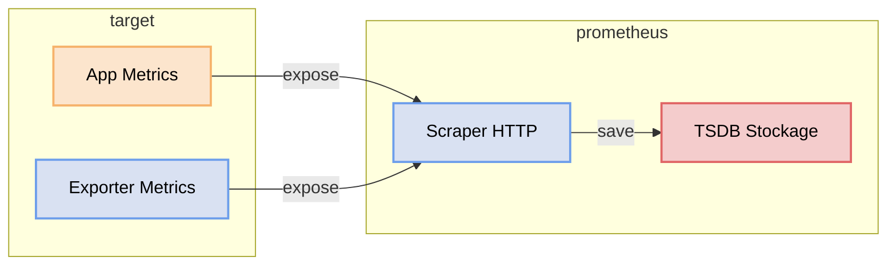
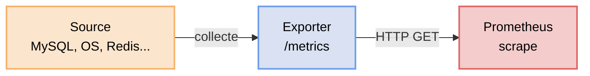

# Installation de Prometheus

Vous voulez surveiller vos applications et être alerté en cas de problème ? Prometheus collecte les métriques de vos services (CPU, mémoire, requêtes HTTP, erreurs…) et vous permet de créer des alertes quand quelque chose dysfonctionne.

## Prérequis
Vous allez installer prometheus sur votre serveur de monitoring. Il vous faut donc un accès ssh sur votre serveur Ubuntu.

## Comprendre le fonctionnement

Dans ce schéma, Prometheus fonctionne selon un modèle **pull (scrape)** :

1. Les applications ou exporters exposent des métriques via un endpoint HTTP (`/metrics`)
2. Le **Scraper Prometheus** interroge régulièrement ces endpoints (par défaut toutes les 15s)
3. Les données récupérées sont stockées dans la **TSDB (Time Series Database)**
4. Ces métriques peuvent ensuite être :
   - interrogées avec **PromQL**
   - utilisées pour créer des dashboards (Grafana)
   - exploitées pour des règles d’alerting
  

👉 Point clé :  
Prometheus **ne reçoit pas les métriques**, il va les chercher lui-même.

👉 Avantage :
- pas besoin que les applications connaissent Prometheus
- meilleure robustesse (pas de perte si Prometheus est temporairement indisponible)
  
## Les exporters

Les exporters sont des **adaptateurs** : ils transforment une source (système, base de données, réseau…) en un endpoint `/metrics` que Prometheus scrappe.

### Où se placent les exporters ?
Flux d’un exporter :


- **Source** : OS, base de données, service réseau, application…
- **Exporter** : pont qui rend la source “scrapable”
- **Prometheus** : collecte, stocke, interroge et alerte

### Exporter ou instrumentation : comment décider ?

| Situation | Solution | Pourquoi |
|----------|---------|----------|
| J’ai le code de l’app | Instrumentation (client libs, OTel) | Métriques métier précises, moins d’approximation |
| Produit tiers, pas de code | Exporter dédié | MySQL, PostgreSQL, Redis, Nginx… |
| Système d’exploitation | Agent (Node/Windows Exporter) | CPU, RAM, disque, réseau |
| Vérifier la disponibilité externe | Blackbox Exporter | Probes HTTP, DNS, TCP, ICMP |

Si vous contrôlez le code, instrumentez l’app avec une librairie prometheus. Un exporter est un pont vers quelque chose que vous ne contrôlez pas.

## Choisir sa version de prometheus
Tout d'abord, il va falloir choisir la version de prometheus que l'on va utiliser dans ce cours.

    Latest (3.x) : recommandé pour lab et stack moderne, nouvelles features
    LTS (3.5 LTS jusqu’au 31 juillet 2026) : recommandé en production si vous voulez limiter les upgrades
    Consultez la page de téléchargement https://prometheus.io/download/ et le cycle de release.

La version 3.5.2 semble être tout indiquée, c'est donc celle que nous utiliserons.

## Créer la configuration

Pour l'instant, créez le fichier prometheus.yml suivant.

```yaml
global:
  scrape_interval: 15s      # Intervalle de collecte des métriques sur toutes les cibles

scrape_configs:
  # Prometheus se scrappe lui-même pour exposer ses propres métriques internes
  - job_name: 'prometheus'  # Nom du job, visible dans les labels de chaque métrique
    static_configs:
      - targets: ['prometheus:9090']  # Adresse du service (nom Docker = résolution DNS automatique)
```
Ce fichier représente la configuration de prometheus : notamment la configuration du scraping et des alertes.
On reviendra sur cela un peu plus tard dans le cours.

## Installation sur Docker
Installez Docker si ce n'est pas déjà fait.
Installez Prometheus sur Docker, en créant un volume persistent pour ses datas et en lui donnant le fichier de configuration précédemment créé.
Pour cela utiliser le fichier docker-compose.yml suivant.

```yaml
services:
  prometheus:
    image: prom/prometheus:v3.11.2       # Image officielle Prometheus
    container_name: prometheus           # Nom fixe du conteneur (utilisé comme nom DNS dans le réseau Docker)
    ports:
      - "9090:9090"                      # port_hôte:port_conteneur
    volumes:
      - ./prometheus.yml:/etc/prometheus/prometheus.yml:ro  # Config montée en lecture seule (:ro)
      - prometheus-data:/prometheus      # Volume persistant pour la base de données TSDB
    command:
      - '--config.file=/etc/prometheus/prometheus.yml'  # Fichier de configuration à utiliser
      - '--storage.tsdb.path=/prometheus'               # Répertoire de stockage des séries temporelles
      - '--web.enable-lifecycle'         # Active le rechargement de config à chaud via l'API REST
    restart: unless-stopped              # Redémarre automatiquement, sauf si arrêté manuellement
    networks:
      - monitoring                       # Réseau partagé avec Grafana et les exporters

volumes:
  prometheus-data:                       # Volume Docker persistant entre les redémarrages

networks:
  monitoring:
    driver: bridge                       # Réseau bridge isolé — les conteneurs se voient par leur nom
```
Lancer la stack
```bash
docker compose up -d
```

## Vérifier le fonctionnement

Prometheus : http://localhost:9090

Targets : http://localhost:9090/targets

## Reload de configuration
Vous serez amené à modifier la configuration prometheus. 
Prometheus peut recharger sa configuration sans redémarrage.

### Via API (recommandé)
Nécessite --web.enable-lifecycle :
```bash
curl -X POST http://localhost:9090/-/reload
```
### Restart conteneur (brutal)
```bash
docker restart prometheus
```
### Vérifier la configuration avant reload
```bash
promtool check config /etc/prometheus/prometheus.yml
```
