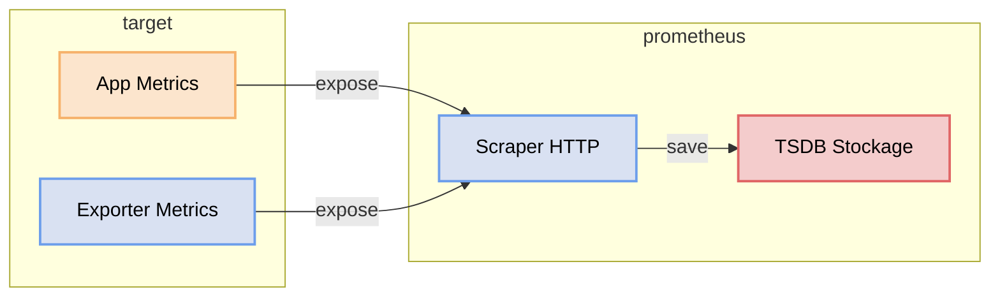

# Monitoring d'un serveur Linux : Prometheus Node Exporter

Prometheus étant installé, penchons-nous sur son mode de fonctionnement.
Prometheus, comme on l'a vu dans le fichier de configuration, va scraper — donc aller rechercher lui-même — toutes les métriques exposées par des cibles (targets).

Contrairement à d'autres systèmes basés sur un modèle push, Prometheus utilise un modèle pull :
ce sont les applications ou leurs exporters qui exposent un endpoint HTTP (généralement /metrics), et Prometheus vient régulièrement interroger ces endpoints pour collecter les métriques.

Ces métriques peuvent provenir :
 - directement d’une application (ex: avec une librairie Prometheus),
 - ou d’un exporter (ex: node-exporter, mysql-exporter) qui transforme des données en métriques exploitables.

👉 En résumé :
vous déployez une application ou un exporter qui expose des métriques.
Vous configurez ensuite Prometheus pour scraper automatiquement ces endpoints à intervalle régulier.



Dans cet exercice, l'objectif sera d'utiliser un **Exporter** pour remonter les informations du **système d'exploitation Ubuntu**.

## Prérequis
Vous allez monitorer un serveur Ubuntu, mais pas le serveur de monitoring lui même. Il vous faut donc un accès ssh à un deuxième serveur Ubuntu.
On pourra alors bien distinguer le serveur de monitoring du serveur monitoré.

## Installation Ubuntu Node Exporter

Le **Node Exporter** permet d’exposer les métriques système d’une machine Linux (CPU, RAM, disque, réseau…) au format Prometheus.
Il vous faut l'installer sur votre serveur Ubuntu à monitorer.

### 1. Télécharger Node Exporter

```bash
wget https://github.com/prometheus/node_exporter/releases/download/v1.11.1/node_exporter-1.11.1.linux-amd64.tar.gz
tar xvf node_exporter-1.11.1.linux-amd64.tar.gz
cd node_exporter-1.11.1.linux-amd64/
```

### 2. Lancer Node Exporter

```bash
./node_exporter
```

Par défaut, Node Exporter expose les métriques sur :

👉 http://localhost:9100/metrics

Cependant, comme nous allons continuer à utiliser cette VM par la suite, il n’est pas souhaitable de laisser Node Exporter s’exécuter au premier plan dans le terminal. De plus, nous voulons qu’il démarre automatiquement et continue de fonctionner même après un redémarrage de la machine.

**Transformez donc Node Exporter en service systemd afin qu’il soit lancé automatiquement au démarrage de la VM (service systemd).**

## Modification configuration Prometheus

Maintenant que Node Exporter expose des métriques, il faut dire à Prometheus sur le serveur de monitoring de les récupérer.

### 1. Modifier le fichier de configuration

Éditez le fichier `prometheus.yml` :

Ajoutez une nouvelle cible dans la section `scrape_configs` :

```yaml
scrape_configs:
  - job_name: 'node-exporter'           # Nom du job, visible dans les labels de chaque métrique
    static_configs:
      - targets: ['localhost:9100']      # Adresse:port où Node Exporter expose /metrics
```
👉 Remplacez `localhost` par l’IP de votre machine si nécessaire.

### 2. Recharger la configuration
Comme vu dans la partie d'installation, il faut recharger la configuration prometheus une fois une modification effectuée.
```bash
curl -X POST http://localhost:9090/-/reload
```
### 3. Vérifier dans l’interface Prometheus

Ouvrez :

👉 http://localhost:9090/targets

Vous devez voir :

- `node-exporter` en **UP**

### 4. Tester les métriques

Dans l’interface Prometheus (Query - onglet *Graph*), testez par exemple :

```promql
node_cpu_seconds_total
```

## Résultat

Prometheus scrape maintenant les métriques système de votre machine Ubuntu via Node Exporter.

Vous pouvez désormais :
- visualiser les métriques
- créer des dashboards Grafana
- mettre en place des alertes
