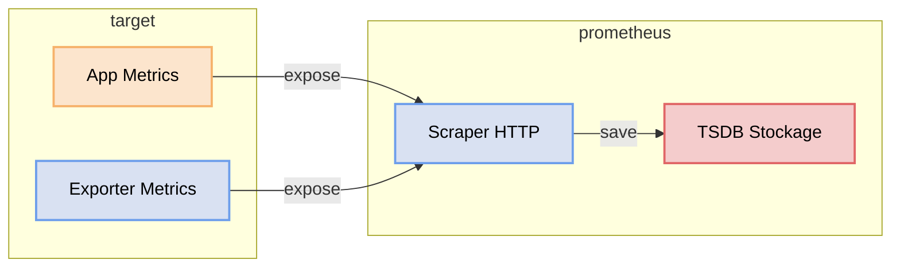

# Monitoring d'une application avec Prometheus

Prometheus, comme on l'a vu dans le fichier de configuration, va scraper — donc aller rechercher lui-même — toutes les métriques exposées par des cibles (targets).



Dans cet exercice, vous allez déployer une application qui expose des métriques. Prometheus sera configuré pour scraper automatiquement ces metrics.


## Création d'une application NodeJS avec des metrics

Dans cette partie, nous allons créer une application **NodeJS** qui expose des métriques compatibles avec **Prometheus** via un endpoint `/metrics`.

L'objectif est d'avoir une petite application avec plusieurs routes pour produire des métriques un peu plus intéressantes qu'un simple compteur global :

- nombre total de requêtes HTTP
- durée des requêtes
- nombre d'erreurs HTTP
- métriques métier simulées
- métriques système par défaut NodeJS

Pour cela, nous allons utiliser la librairie `prom-client`, qui permet d'exposer des métriques au format Prometheus.

### Initialisation du projet

Créer un nouveau projet NodeJS :

```bash
mkdir node-metrics-app
cd node-metrics-app
npm init -y
```

Installer les dépendances :

```bash
npm install express prom-client
```

### Création de l'application

Créer un fichier `index.js` :

```js
const express = require('express');
const client = require('prom-client');

const app = express();
const port = 3000;

// Registre Prometheus
const register = new client.Registry();

// Ajout d'un label global
register.setDefaultLabels({
  app: 'node-metrics-demo',
});

// Collecte des métriques système NodeJS par défaut
client.collectDefaultMetrics({ register });

// =========================
// Métriques personnalisées
// =========================

// Compteur global des requêtes HTTP
const httpRequestsTotal = new client.Counter({
  name: 'http_requests_total',
  help: 'Nombre total de requêtes HTTP reçues',
  labelNames: ['method', 'route', 'status_code'],
  registers: [register],
});

// Histogramme de durée des requêtes
const httpRequestDurationSeconds = new client.Histogram({
  name: 'http_request_duration_seconds',
  help: 'Durée des requêtes HTTP en secondes',
  labelNames: ['method', 'route', 'status_code'],
  buckets: [0.005, 0.01, 0.05, 0.1, 0.3, 0.5, 1, 2, 5],
  registers: [register],
});

// Compteur d'erreurs applicatives
const appErrorsTotal = new client.Counter({
  name: 'app_errors_total',
  help: 'Nombre total d erreurs applicatives',
  labelNames: ['route', 'type'],
  registers: [register],
});

// Gauge représentant le nombre d'utilisateurs connectés simulés
const activeUsers = new client.Gauge({
  name: 'app_active_users',
  help: 'Nombre d utilisateurs actifs simulés',
  registers: [register],
});

// Counter métier simulé : commandes créées
const ordersCreatedTotal = new client.Counter({
  name: 'orders_created_total',
  help: 'Nombre total de commandes creees',
  labelNames: ['status'],
  registers: [register],
});

// Histogramme métier simulé : montant des commandes
const orderAmountEuros = new client.Histogram({
  name: 'order_amount_euros',
  help: 'Distribution du montant des commandes en euros',
  buckets: [10, 20, 50, 100, 200, 500, 1000],
  registers: [register],
});

// =========================
// Middleware de mesure HTTP
// =========================

app.use((req, res, next) => {
  const end = httpRequestDurationSeconds.startTimer();

  res.on('finish', () => {
    const route = req.route?.path || req.path || 'unknown';
    const statusCode = res.statusCode.toString();

    httpRequestsTotal.inc({
      method: req.method,
      route,
      status_code: statusCode,
    });

    end({
      method: req.method,
      route,
      status_code: statusCode,
    });
  });

  next();
});

// =========================
// Routes de démonstration
// =========================

// Route simple
app.get('/', (req, res) => {
  res.send('Hello World avec metrics');
});

// Route de santé
app.get('/health', (req, res) => {
  res.status(200).json({ status: 'ok' });
});

// Route lente simulée
app.get('/slow', (req, res) => {
  const delay = Math.floor(Math.random() * 1500) + 300;

  setTimeout(() => {
    res.json({
      message: 'Réponse lente simulée',
      delay_ms: delay,
    });
  }, delay);
});

// Route d'erreur simulée
app.get('/error', (req, res) => {
  appErrorsTotal.inc({
    route: '/error',
    type: 'simulated_error',
  });

  res.status(500).json({
    error: 'Erreur simulée pour Prometheus',
  });
});

// Route métier simulée : création d'une commande
app.post('/orders', (req, res) => {
  const amount = Math.floor(Math.random() * 500) + 20;
  const success = Math.random() > 0.2;

  orderAmountEuros.observe(amount);

  if (success) {
    ordersCreatedTotal.inc({ status: 'success' });
    return res.status(201).json({
      message: 'Commande créée',
      amount,
      status: 'success',
    });
  }

  ordersCreatedTotal.inc({ status: 'failed' });
  appErrorsTotal.inc({
    route: '/orders',
    type: 'order_creation_failed',
  });

  return res.status(500).json({
    message: 'Echec de création de commande',
    amount,
    status: 'failed',
  });
});

// Route qui fait varier une gauge
app.get('/users', (req, res) => {
  const simulatedUsers = Math.floor(Math.random() * 100) + 1;
  activeUsers.set(simulatedUsers);

  res.json({
    active_users: simulatedUsers,
  });
});

// Endpoint metrics pour Prometheus
app.get('/metrics', async (req, res) => {
  res.set('Content-Type', register.contentType);
  res.end(await register.metrics());
});

// Démarrage
app.listen(port, () => {
  console.log(`Application disponible sur http://localhost:${port}`);
  console.log(`Metrics disponibles sur http://localhost:${port}/metrics`);
});
```
### Dockeriser l'application
En créant un Dockerfile.
```dockerfile
FROM node:20-alpine             # Image Node.js légère basée sur Alpine Linux
WORKDIR /app                    # Répertoire de travail à l'intérieur du conteneur
COPY package*.json ./           # Copie d'abord les fichiers de dépendances (optimise le cache Docker)
RUN npm ci --omit=dev           # Installe uniquement les dépendances de production
COPY . .                        # Copie le reste du code source
EXPOSE 3000                     # Documente le port utilisé (ne l'ouvre pas réellement)
CMD ["node", "index.js"]        # Commande lancée au démarrage du conteneur
```
Et démarrer l'application
```bash
docker build -t node-metrics-app .
docker run -d --name node-metrics-app -p 3000:3000 node-metrics-app
```
Tester quelques routes :

```bash
curl http://localhost:3000/
curl http://localhost:3000/health
curl http://localhost:3000/slow
curl http://localhost:3000/error
curl -X POST http://localhost:3000/orders
curl http://localhost:3000/users
curl http://localhost:3000/metrics
```

### Comprendre les métriques exposées

Cette application expose plusieurs types de métriques :

#### 1. `Counter`
Un compteur ne fait qu'augmenter.

Exemples :
- `http_requests_total`
- `app_errors_total`
- `orders_created_total`

#### 2. `Gauge`
Une gauge peut monter ou descendre.

Exemple :
- `app_active_users`

#### 3. `Histogram`
Un histogramme permet de mesurer une distribution, par exemple des temps de réponse ou des montants.

Exemples :
- `http_request_duration_seconds`
- `order_amount_euros`

#### 4. Métriques par défaut NodeJS
`prom-client` peut aussi exposer automatiquement des métriques système :

- utilisation mémoire
- usage CPU
- event loop lag
- garbage collector
- etc.

## Configuration de Prometheus

### 1. Modifier le fichier de configuration
Ajouter une nouvelle target dans le fichier `prometheus.yml` :

```yaml
  - job_name: 'node-app'               # Nom du job, visible dans les labels de chaque métrique
    static_configs:
      - targets: ['ipduServeur:3000']   # Remplacez par l'IP réelle de votre serveur applicatif
```


### 2. Recharger la configuration
Comme vu dans la partie d'installation, il faut recharger la configuration prometheus une fois une modification effectuée.
```bash
curl -X POST http://localhost:9090/-/reload
```
### 3. Vérifier dans l’interface Prometheus

Ouvrez :

👉 http://localhost:9090/targets


Ouvrir l'interface web :

```text
http://localhost:9090
```

Dans l'onglet **Graph**, essayer quelques requêtes PromQL :

```promql
http_requests_total
```

```promql
app_errors_total
```

```promql
app_active_users
```

```promql
orders_created_total
```

```promql
rate(http_requests_total[1m])
```

```promql
rate(app_errors_total[5m])
```

```promql
histogram_quantile(0.95, sum(rate(http_request_duration_seconds_bucket[5m])) by (le))
```

## Résultat

Prometheus scrape maintenant les métriques système de votre application Node.

Vous pouvez désormais :
- visualiser les métriques
- créer des dashboards Grafana
- mettre en place des alertes

Prometheus ne reçoit pas les métriques poussées par l'application : c'est lui qui vient les lire régulièrement sur l'endpoint `/metrics`.
