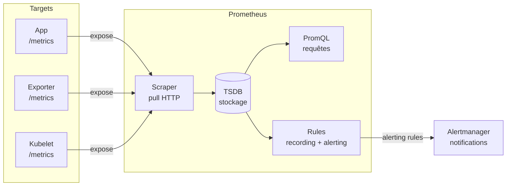

# Prometheus

Article à lire pour compléter vos connaissances et approfondir votre compréhension. 

## Modèle mental : comment les briques s’emboîtent

Prometheus fonctionne en **5 étapes**. Comprendre ce flux évite 80% des confusions :



| Étape | Composant | Ce qu’il fait |
|------|----------|---------------|
| 1 | Targets | Exposent `/metrics` au format Prometheus/OpenMetrics |
| 2 | Scraper | Pull HTTP toutes les 15s (configurable) |
| 3 | TSDB | Stocke les séries temporelles sur disque local |
| 4 | PromQL | Interroge les données (dashboards, API) |
| 4b | Rules | Pré-calcule (recording) ou évalue les alertes |
| 5 | Alertmanager | Route et notifie (Slack, email, PagerDuty…) |


### Prometheus ≠ Alertmanager

Ce sont deux composants séparés :

- **Prometheus** évalue les règles d’alerte  
- **Alertmanager** gère le routage et les notifications  

## Les 4 types de métriques

| Type | Description | Quand l’utiliser |
|------|------------|------------------|
| Counter | Compteur croissant uniquement | Requêtes, erreurs, bytes envoyés |
| Gauge | Valeur qui monte et descend | Mémoire, température, connexions actives |
| Histogram | Distribution avec buckets | Latences (recommandé), tailles de requêtes |
| Summary | Quantiles calculés côté client | Latences (moins agrégable que histogram) |

### Histogram vs Summary

👉 Préférez **Histogram côté serveur** :

- Quantiles calculables via PromQL  
- Agrégables entre plusieurs instances  

❌ Summary :

- Calcul côté client  
- Non agrégable entre pods  

## Labels : puissance et piège n°1

Les labels sont des paires clé-valeur qui enrichissent vos métriques.

### Exemple

```text
# Sans labels : une seule série
http_requests_total

# Avec labels : filtrage et agrégation flexibles
http_requests_total{method="GET", status="200", handler="/api/users"}
```

### Le piège : cardinalité explosive

Chaque combinaison unique de labels = **une série temporelle en mémoire**.

| Label | Valeurs possibles | Impact |
|------|------------------|--------|
| method | GET, POST, PUT, DELETE | 4 séries → ✅ OK |
| status | 200, 201, 400, 404, 500 | 5 séries → ✅ OK |
| user_id | 1M utilisateurs | 1M séries → ❌ OOM garanti |
| request_id | UUID unique | ∞ séries → ❌ Catastrophe |

### Anti-pattern cardinalité

Ne jamais utiliser de labels avec valeurs non bornées :

- `user_id`
- `request_id`
- `trace_id`

👉 Alternatives :
- histogrammes
- système de traces (OpenTelemetry, Tempo…)

## Prometheus ne collecte pas tout seul

Prometheus scrappe des endpoints `/metrics`.

Pour exposer ces endpoints :

| Outil | Rôle | Exemple |
|------|------|---------|
| Exporter | Transforme une source → `/metrics` | node_exporter, mysql_exporter |
| Instrumentation | Code qui expose des métriques | Micrometer (Java), prometheus_client (Python) |
| OTel Collector | Routeur multi-signaux, peut exposer pour Prometheus | Alternative moderne |

## Infos pratiques

### Ports & endpoints

| Port | Endpoint | Usage |
|------|---------|------|
| 9090 | / | Interface web Prometheus |
| 9090 | /metrics | Métriques de Prometheus lui-même |
| 9090 | /targets | État des targets scrapées |
| 9090 | /alerts | Alertes actives |
| 9090 | /api/v1/query | API PromQL |
| 9093 | / | Interface Alertmanager |

### Rétention

Par défaut, Prometheus stocke les données localement avec une rétention limitée (souvent 15 jours).

### Sécurité

- Pas d’authentification native forte (à sécuriser via reverse proxy)
- À ne pas exposer directement sur Internet
- Utiliser HTTPS via un proxy (NGINX, Traefik)
